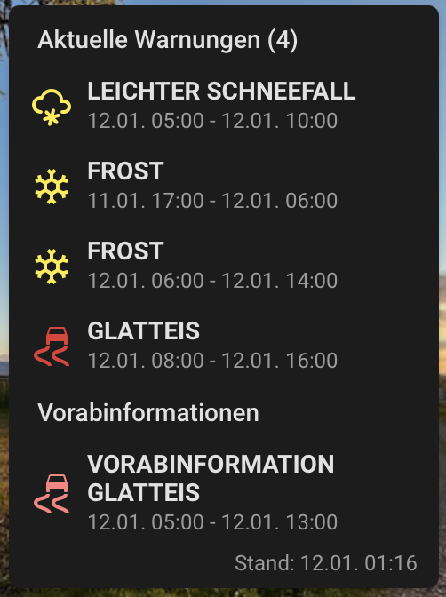

# DWD Weather Warnings Card


A custom Home Assistant lovelace card to display Deutscher Wetterdienst (DWD) weather warnings with a modern, clean design. The goal is to have a very compatct view for small displays:



You can install the releases via HACS directly in Home Assistant:
[](https://my.home-assistant.io/redirect/hacs_repository/?owner=thkemmer&repository=ha-dwd-card&category=plugin)

## Features

- **Dynamic Icons:** Automatically selects the correct icon based on the warning type (e.g., Ice, Wind, Storm, it's incomplete though and will be extended over time).
- **Official Colors:** Uses the severity colors defined by the DWD integration.
- **Pre-Warnings:** Separately lists pre-warnings.
- **Visual Editor:** Fully supported!

## Installation

### HACS (Recommended)

Click the button above or:

1.  Make sure [HACS](https://hacs.xyz/) is installed.
2.  Go to HACS -> Frontend -> Custom Repositories.
3.  Add this repository URL and select "Lovelace" as the category.
4.  Click "Install".
5.  Reload your resources.

### Manual

1.  Download `ha-dwd-card.js` from the latest release.
2.  Upload it to your Home Assistant `www` folder.
3.  Add it to your resources in Dashboard -> `...` -> Edit Dashboard -> `...` -> Manage Resources.
    - URL: `/local/ha-dwd-card.js`
    - Type: JavaScript Module

## Configuration

### YAML

```yaml
type: custom:ha-dwd-card
current_warning_entity: sensor.dwd_weather_warnings_berlin_current_warning_level
# Optional: explicitly define the pre-warning entity
# prewarning_entity: sensor.dwd_weather_warnings_berlin_prewarning_level
# Optional: Show section headlines (default: false)
show_current_warnings_headline: true
# Optional: Use shorter warning name instead of headline (default: false)
compact_warning_headline: true
```

**Note:** If `prewarning_entity` is not provided, the card automatically attempts to find the corresponding `_prewarning_level` entity based on the `current_warning_entity` you provide. Ensure your DWD integration naming convention is standard.

## Testing

This project uses [Vitest](https://vitest.dev/) for unit testing. Vitest is a fast, modern testing framework with native TypeScript support and an environment that mimics the browser (JSDOM), making it ideal for testing Lit-based web components.

### Running Tests

To run the tests once:

```bash
npm run test
```

To run tests in watch mode (useful during development):

```bash
npx vitest
```

The tests cover:

- **Component Rendering:** Ensuring the card loads correctly in different states.
- **Logic Verification:** Specifically testing the `getCardSize()` method to ensure correct dashboard layout.
- **Mocking:** Tests use a mocked Home Assistant (`hass`) object to simulate various warning scenarios.

### Continuous Integration (CI)

Every push and pull request to the `main` branch automatically triggers a test run and linting check via GitHub Actions to ensure code quality and prevent regressions.

## Local Preview

You can run a local preview of the card with mock data to quickly test configuration changes and different warning scenarios:

1.  Build the project: `npm run build`
2.  Start the local server: `npm start`
3.  Open [http://localhost:8000/demo/](http://localhost:8000/demo/) in your browser.

## Development

1.  Clone this repository.
2.  Run `npm install`.
3.  Run `npm run watch` to start the development build.
4.  The built file will be in `dist/ha-dwd-card.js`.
