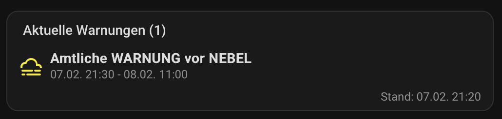
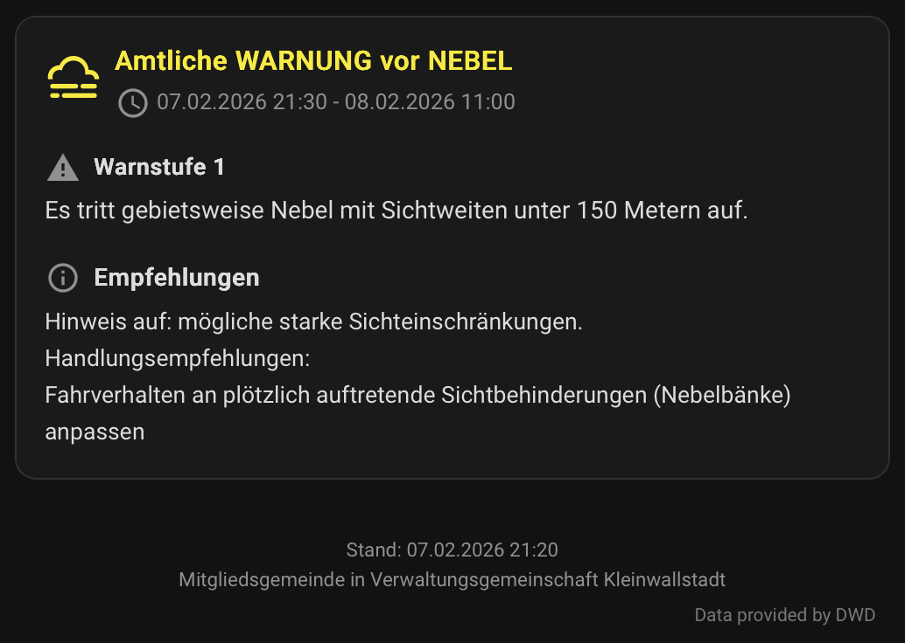
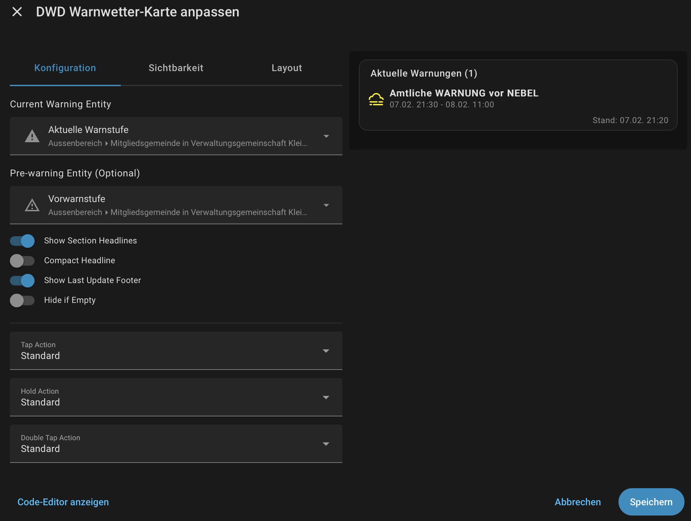
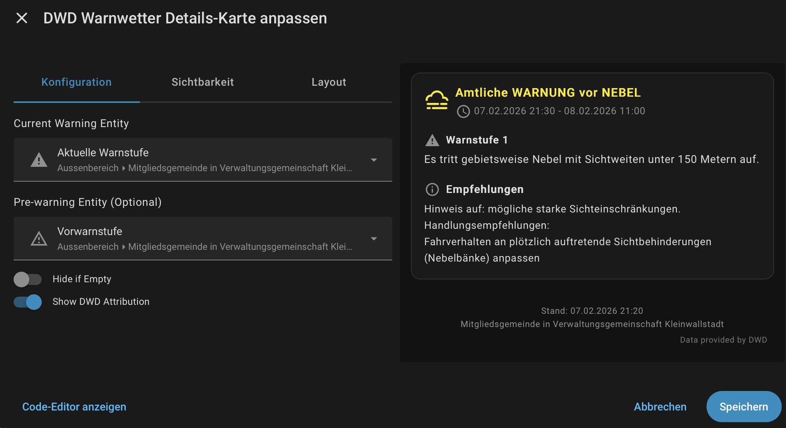

# DWD Weather Warnings Card


A custom Home Assistant lovelace card to display Deutscher Wetterdienst (DWD) weather warnings with a modern, clean design. This project provides two different cards to suit your needs: a compact overview card and a detailed information card.

| **Standard Card** | **Details Card** |
| :---: | :---: |
|  |  |
| *Compact overview for small displays* | *Detailed information and instructions* |

You can install the releases via HACS directly in Home Assistant:
[](https://my.home-assistant.io/redirect/hacs_repository/?owner=thkemmer&repository=ha-dwd-card&category=plugin)

## Features

- **Dynamic Icons:** Automatically selects the correct icon based on the warning type (Ice, Wind, Storm, etc.).
- **Official Colors:** Uses the severity colors defined by the DWD.
- **Pre-Warnings:** Support for separate pre-warning entities.
- **Visual Editor:** Full support for the Home Assistant dashboard editor.
- **Modern UI:** Clean, responsive design that integrates well with Home Assistant.
- **Action Support:** Support for standard tap, hold, and double-tap actions (Standard Card).

## Prerequisites

This card requires the official [Deutscher Wetterdienst (DWD) Weather Warnings](https://www.home-assistant.io/integrations/dwd_weather_warnings/) integration to be installed and configured in your Home Assistant instance.

## Installation

### HACS (Recommended)

Click the button above or:

1.  Make sure [HACS](https://hacs.xyz/) is installed.
2.  Go to HACS -> Frontend -> Custom Repositories.
3.  Add this repository URL and select "Lovelace" as the category.
4.  Click "Install".
5.  Reload your resources.

### Manual

1.  Download `ha-dwd-card.js` from the latest release.
2.  Upload it to your Home Assistant `www` folder.
3.  Add it to your resources in Dashboard -> `...` -> Edit Dashboard -> `...` -> Manage Resources.
    - URL: `/local/ha-dwd-card.js`
    - Type: JavaScript Module

## Configuration

Both cards provide a visual editor for easy configuration.

### Visual Editor

| **Standard Card Editor** | **Details Card Editor** |
| :---: | :---: |
|  |  |

### Standard Card (`custom:ha-dwd-card`)

Ideal for overview dashboards where space is limited.

| Name | Type | Default | Description |
| :--- | :--- | :--- | :--- |
| `current_warning_entity` | string | **Required** | The entity ID of the current warning level sensor. |
| `prewarning_entity` | string | Optional | The entity ID of the pre-warning level sensor. Auto-derived if omitted. |
| `show_current_warnings_headline` | boolean | `false` | Show section headlines (e.g., "Aktuelle Warnungen"). |
| `compact_warning_headline` | boolean | `false` | Use shorter warning name instead of verbose headline. |
| `show_last_update_footer` | boolean | `true` | Show the last update timestamp. |
| `hide_empty` | boolean | `false` | Hide the card if no warnings are active. |
| `tap_action` | ActionConfig | `more-info` | Action to perform on tap. |
| `hold_action` | ActionConfig | - | Action to perform on hold. |
| `double_tap_action` | ActionConfig | - | Action to perform on double tap. |

### Details Card (`custom:ha-dwd-details-card`)

Ideal for dedicated weather dashboards or as a "more-info" card.

| Name | Type | Default | Description |
| :--- | :--- | :--- | :--- |
| `current_warning_entity` | string | **Required** | The entity ID of the current warning level sensor. |
| `prewarning_entity` | string | Optional | The entity ID of the pre-warning level sensor. |
| `hide_empty` | boolean | `false` | Hide the card if no warnings are active. |
| `show_dwd_attribution` | boolean | `true` | Show the official DWD attribution text. |

## YAML Examples

### Standard Card
```yaml
type: custom:ha-dwd-card
current_warning_entity: sensor.dwd_weather_warnings_berlin_current_warning_level
show_current_warnings_headline: true
compact_warning_headline: true
```

### Details Card
```yaml
type: custom:ha-dwd-details-card
current_warning_entity: sensor.dwd_weather_warnings_berlin_current_warning_level
show_dwd_attribution: true
```

## Testing

This project uses [Vitest](https://vitest.dev/) for unit testing.

```bash
npm run test
```

## Local Preview

1.  Build the project: `npm run build`
2.  Start the local server: `npm start`
3.  Open [http://localhost:8000/demo/](http://localhost:8000/demo/) in your browser.

## Development

1.  Clone this repository and run `npm install`.
2.  **Production build:** `npm run build`
3.  **Development build:** `npm run build:dev`
4.  **Watch mode:** `npm run watch`